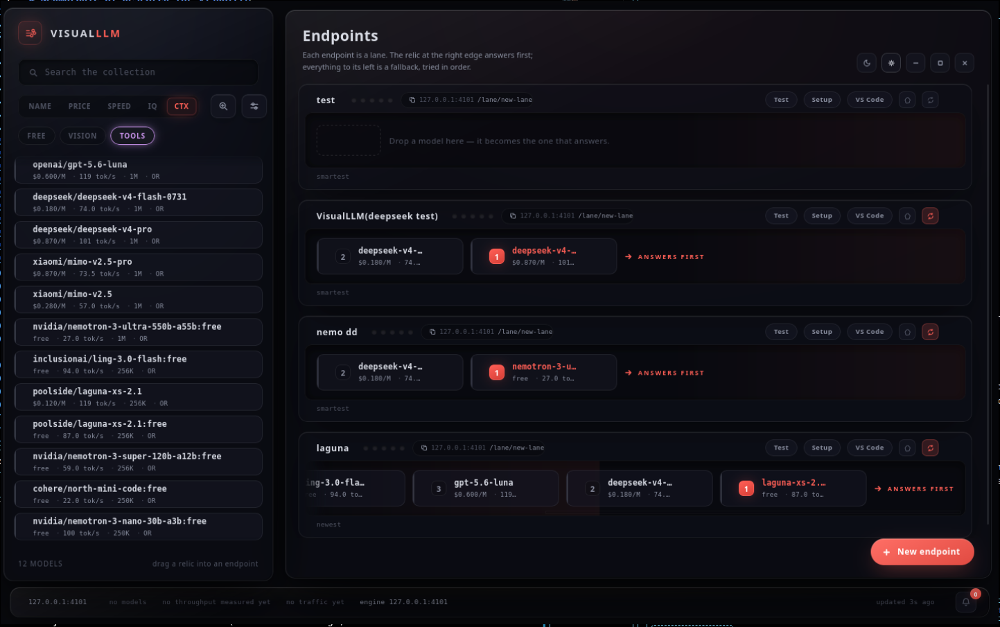
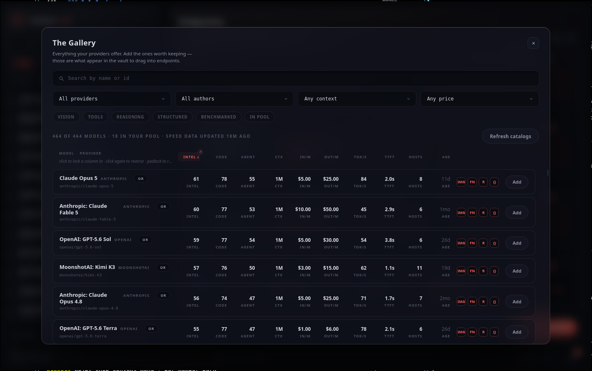
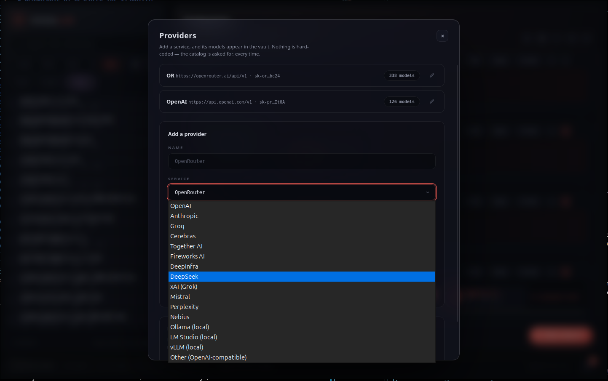
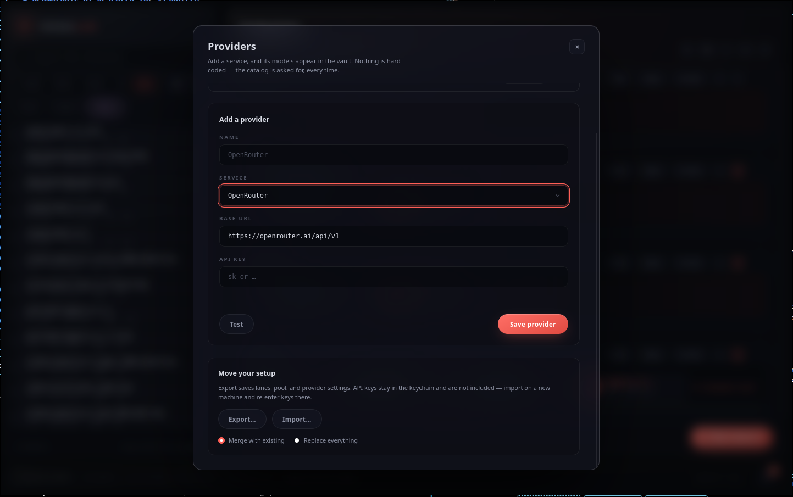

# VisualLLM

**Build reliable OpenAI-compatible endpoints by arranging AI models visually.**

[](LICENSE)
[](https://www.rust-lang.org/)
[](https://tauri.app/)



Routing, made visible. The **vault** on the left holds the models you've kept; the **endpoints** on the right are live OpenAI-compatible servers. The relic at the right edge of each lane answers first — everything to its left is a fallback, tried in order.

---

## What is VisualLLM?

VisualLLM is a **visual fallback router** for AI models. It's a desktop application that lets you:

- **Add your AI providers** (OpenRouter, OpenAI, Anthropic, or any OpenAI-compatible endpoint)
- **Browse their model catalogs** with rich filtering and sorting
- **Drag models into ordered "lanes"** to create fallback chains
- **Expose lanes as local OpenAI-compatible endpoints** that your tools can connect to

When a request comes in, the rightmost model answers first. If it fails, can't serve the request, or returns unusable content, VisualLLM automatically tries the next model in line — and explains exactly what happened at each step.

---

## A Look Inside

<table>
  <tr>
    <td width="50%">
      
      <p align="center"><b>The Gallery.</b> Every model your providers offer, with intelligence, coding, and agentic scores, context size, price, and measured speed. Lock the columns you care about and the list sorts by them.</p>
    </td>
    <td width="50%">
      
      <p align="center"><b>Providers.</b> OpenRouter, OpenAI, Anthropic, Groq, Together, DeepSeek, xAI, Mistral, or any OpenAI-compatible endpoint — including local servers like Ollama, LM Studio, and vLLM.</p>
    </td>
  </tr>
  <tr>
    <td colspan="2">
      
      <p align="center"><b>Adding a provider.</b> Keys are stored in the OS keychain and never leave the Rust backend. Export your setup to move it between machines — keys stay behind.</p>
    </td>
  </tr>
</table>

The interface is an installation: a living, reaction-diffusion field rendered on the GPU (with an honest CPU fallback), slabs of smoked acrylic floating above it, and a lane's traffic rippling through the chemistry at its own position. Nothing is a static rectangle.

---

### The Problem It Solves

Most AI gateway solutions make routing a configuration problem — editing YAML files, managing complex rules, or writing code. VisualLLM makes it **visible and intuitive**: you see your models, you arrange them in order, and the system does exactly what you expect.

This is especially valuable when:
- You want **automatic fallback** when a provider is rate-limited, out of credit, or unavailable
- You need **reliable responses** and want to understand exactly which model served each request
- You use **multiple providers** and want to route requests based on capability, not just availability
- You want **transparency** — knowing not just that a request succeeded, but *which* model answered and *why*

---

## Why VisualLLM?

### 🎯 Visual First
Everything is arranged visually. No configuration files to edit, no YAML to learn. What you see is what you get.

### 🔒 Secure by Design
- **API keys never leave the Rust backend** — the webview has no network or filesystem access
- **Keys are stored in the OS keychain** (Linux native), not in plaintext files
- **All network requests flow through Rust** — the renderer only receives state, never credentials
- **Bound to loopback (127.0.0.1)** — your endpoints are local-only by default

### 📊 Intelligent Routing
- **Capability checking** — models that can't serve your request are skipped, not tried
- **Commit gate** — 200 responses are verified to contain usable content before forwarding
- **Loop detection** — optional Loopwatch catches agents stuck in tool-call loops
- **Detailed receipts** — every failure is recorded with evidence for debugging

### 🔄 Honest Fallback
A response isn't successful just because a provider returned HTTP 200. VisualLLM verifies that:
- The response contains actual content (not just reasoning tokens)
- The model can actually serve the request (vision, tools, context size)
- The stream hasn't stalled or died mid-response

Every response includes headers telling you:
- `x-visualllm-served-by` — which model actually answered
- `x-visualllm-passed-over` — how many models were skipped or failed
- `x-visualllm-trail` — the complete story of what happened

### 💡 Built for Developers
- **OpenAI-compatible** — works with VS Code, Cursor, and any OpenAI-compatible client
- **No build step** — the renderer is plain HTML/CSS/JS
- **Rust backend** — fast, safe, and reliable
- **Tauri framework** — lightweight, secure desktop app

---

## Quick Start

### For Users (Pre-built)

Once packaged, VisualLLM will be available as:
- `.deb` for Debian/Ubuntu
- AppImage for any Linux distribution
- (Windows/macOS support planned — see [ROADMAP.md](ROADMAP.md))

### For Developers (From Source)

#### Prerequisites

**Linux (Ubuntu/Debian):**
```bash
# System dependencies for WebKit and Tauri
sudo apt update && sudo apt install -y \
  libwebkit2gtk-4.1-dev libxdo-dev libayatana-appindicator3-dev librsvg2-dev \
  build-essential curl wget file libssl-dev

# Rust toolchain
curl --proto '=https' --tlsv1.2 -sSf https://sh.rustup.rs | sh
source "$HOME/.cargo/env"

# Node.js (for build tooling)
nvm install --lts  # or: sudo apt install nodejs npm
```

**Other distributions:** See [detailed instructions](#detailed-installation-instructions) below.

#### Build and Run

```bash
# Clone the repository
cd /path/to/visualllm

# Install dependencies
npm ci

# Verify everything works
node tools/smoke.js
cargo test --manifest-path src-tauri/Cargo.toml

# Run the app in development mode
npm run dev

# Build release packages (.deb + AppImage on Linux)
npm run build

# Or run the compiled binary outside a snap-polluted terminal
# (prefers target/release if it exists, otherwise target/debug)
tools/launch-system.sh
```

The app will open a window and start the engine on `http://127.0.0.1:4100`.

---

## Using VisualLLM

### 1. Add a Provider

Click **Providers** in the sidebar, then **Add Provider**. Enter:
- **Name** — a friendly name for this provider
- **Kind** — `openrouter`, `openai`, `anthropic`, or `generic`
- **Base URL** — the API endpoint (defaults based on kind)
- **API Key** — your secret key (stored securely in the OS keychain)

### 2. Browse Models

Click **Browse** to see all models from your configured providers. Use the filters and sorting options to find what you need:
- Filter by capability (vision, tools, reasoning)
- Sort by intelligence, coding, agentic scores (OpenRouter)
- Filter by author, context size, price

### 3. Build a Lane

Click **Pool** to select models you're interested in. Then:
1. Click **New Lane**
2. Drag models from the pool into your lane (right to left = primary to fallback)
3. Give it a name and save

The lane is now a local OpenAI-compatible endpoint at:
```
http://127.0.0.1:4100/lane/<lane-slug>/v1
```

### 4. Connect Your Client

**VS Code / Cursor / Any OpenAI-compatible client:**

- **Base URL:** `http://127.0.0.1:4100/lane/<lane-slug>/v1`
- **Model:** `<lane-slug>` (the same as your lane name)
- **API Key:** Leave blank (or use any placeholder if required)

**Direct cURL request:**
```bash
curl http://127.0.0.1:4100/lane/my-lane/v1/chat/completions \
  -H 'Content-Type: application/json' \
  -d '{
    "model": "my-lane",
    "messages": [{"role": "user", "content": "Hello"}],
    "max_tokens": 50
  }'
```

---

## Advanced Features

### Per-Member Settings

Each model in a lane can have its own parameters:
- Temperature, top-p, frequency/presence/repetition penalties
- Max tokens limit
- These override the client's request for that specific model

### Reasoning Suppression

Enable **"No thinking"** on a lane to ask providers (that support it) to skip reasoning tokens. This is a preference, not a guarantee — the commit gate catches models that think anyway.

### Loopwatch

Enable **"Unstick"** on a lane to detect and break tool-call loops:
- **Repeat loops:** Same tool called with same arguments multiple times
- **Futile loops:** Different arguments returning identical results
- The loop is collapsed and a diagnostic note is appended to the conversation

### Incident Records

Every failure is recorded with:
- Timestamp and which lane/member failed
- The failure kind (rate_limited, out_of_credit, capability_gap, etc.)
- The evidence (provider error messages, trail notes)
- Lane settings at the time (no_think, loopwatch enabled)

Click the bell icon in the status bar to view recent incidents.

### Export and Import

Your lanes, pool, and provider configuration can move between machines:

- **Export** — open the **Providers** panel and click **Export…**. This saves a
  JSON file containing lanes, pool, and provider settings. API keys are
  **never** included; they stay in your OS keychain.
- **Import** — click **Import…** and choose a previously exported file.
  - **Merge** — combines the file with your current state. Existing providers
    keep their local API keys, and lanes with the same slug are updated rather
    than duplicated.
  - **Replace** — wipes your current lanes, pool, and providers and loads the
  file exactly. You will need to re-enter API keys afterward.

---

## Architecture

### Security Model

VisualLLM follows a strict security architecture:

```
┌─────────────────────────────────────────────────────────┐
│                    TAURI APPLICATION                        │
├─────────────────────────────────────────────────────────┤
│  ┌─────────────────┐      ┌─────────────────────────────┐ │
│  │   WEBVIEW       │      │         RUST BACKEND          │ │
│  │  (Renderer)      │      │  (src-tauri/src/)             │ │
│  │                 │      │                             │ │
│  │  • HTML/CSS/JS   │      │  • Provider key storage      │ │
│  │  • No network    │◄─────┤  • Catalog fetching          │ │
│  │  • No filesystem │      │  • Request routing           │ │
│  │  • Tauri commands│      │  • Fallback logic            │ │
│  │                 │      │  • Loop detection             │ │
│  │                 │      │  • Incident recording         │ │
│  └─────────────────┘      └─────────────────────────────┘ │
└─────────────────────────────────────────────────────────┘
                              │
                              ▼
                    ┌─────────────────┐
                    │  OS Keychain     │  ← API keys stored here
                    └─────────────────┘
```

**The webview can only:**
- Render the UI
- Call Tauri commands defined in `src-tauri/src/main.rs`
- Receive state from the Rust backend

**The webview CANNOT:**
- Make HTTP requests
- Access the filesystem
- Read API keys
- Execute arbitrary code

### File Structure

```
visualllm/
├── renderer/               # Frontend (HTML/CSS/JS)
│   ├── index.html          # Main window
│   ├── style.css           # Styles
│   └── app.js              # All UI logic
├── src-tauri/               # Backend (Rust)
│   ├── src/
│   │   ├── main.rs         # Tauri shell, commands
│   │   ├── server.rs       # HTTP engine, routing
│   │   ├── providers.rs    # Provider management, catalogs
│   │   ├── lanes.rs        # Lane storage and management
│   │   ├── incidents.rs    # Failure recording
│   │   └── loopwatch.rs    # Loop detection
│   ├── Cargo.toml          # Rust dependencies
│   └── tauri.conf.json     # Tauri configuration
├── tools/                  # Development scripts
│   ├── smoke.js            # Renderer smoke test
│   └── preview.js          # Browser preview harness
├── README.md               # This file
├── ROADMAP.md              # Public release plan
├── CONTRIBUTING.md         # Development guidelines
├── SECURITY.md             # Security policy
└── LICENSE                 # MIT License
```

### How a Request Flows

```
Client Request
     │
     ▼
┌─────────────────────┐
│  Engine (server.rs)  │  ← Listens on 127.0.0.1:4100
└─────────────────────┘
     │
     ▼
┌─────────────────────┐
│  Find Lane           │  ← Looks up lane by slug
└─────────────────────┘
     │
     ▼
┌─────────────────────┐
│  Inspect Request     │  ← Checks vision, tools, token needs
└─────────────────────┘
     │
     ▼
┌─────────────────────┐
│  Walk Members        │  ← Tries each model in order
└─────────────────────┘
     │
     ├─ Can this model serve? (capability check)
     │
     ▼
┌─────────────────────┐
│  Send to Provider    │  ← With member-specific params
└─────────────────────┘
     │
     ▼
┌─────────────────────┐
│  Verify Response     │  ← Commit gate: has usable content?
└─────────────────────┘
     │
     ├─ If usable: Forward to client with headers
     │
     ▼
┌─────────────────────┐
│  Try Next Member     │  ← If failed or unusable
└─────────────────────┘
     │
     ▼
┌─────────────────────┐
│  Return Error        │  ← If all members failed
└─────────────────────┘
```

---

## Detailed Installation Instructions

### Linux

#### Ubuntu / Debian

```bash
# Install system dependencies
sudo apt update && sudo apt install -y \
  libwebkit2gtk-4.1-dev libxdo-dev libayatana-appindicator3-dev librsvg2-dev \
  build-essential curl wget file libssl-dev libgtk-3-dev

# Install Rust
curl --proto '=https' --tlsv1.2 -sSf https://sh.rustup.rs | sh
source "$HOME/.cargo/env"
rustup default stable

# Install Node.js (via nvm recommended)
curl -o- https://raw.githubusercontent.com/nvm-sh/nvm/v0.39.7/install.sh | bash
source ~/.bashrc
nvm install --lts
```

#### Fedora

```bash
sudo dnf install -y \
  webkit2gtk4.1-devel libxdo-devel libayatana-appindicator-gtk3-devel librsvg2-devel \
  gcc gcc-c++ make openssl-devel gtk3-devel

# Then install Rust and Node.js as above
```

#### Arch Linux

```bash
sudo pacman -S \
  webkit2gtk-4.1 libxdo libayatana-appindicator librsvg base-devel openssl gtk3

# Then install Rust and Node.js as above
```

### Running the App

For reliable launching on Linux (especially under Wayland or in snap environments):

```bash
# From the repo root
export PATH="$HOME/.cargo/bin:$PATH"

env -i \
  HOME="$HOME" \
  PATH="/usr/bin:/bin:$HOME/.cargo/bin" \
  DISPLAY="${DISPLAY:-:0}" \
  XAUTHORITY="${XAUTHORITY:-$HOME/.Xauthority}" \
  ./src-tauri/target/debug/visualllm
```

**Why this works:**
- `env -i` starts with a clean environment (no snap library conflicts)
- Explicitly sets the paths needed for GTK/WebKit
- Works with both X11 and Wayland

### Troubleshooting

| Issue | Solution |
|-------|----------|
| `symbol lookup error: libpthread` | You're inheriting snap's `LD_LIBRARY_PATH`. Use the `env -i` launch command above. |
| `Failed to initialize GTK` | Missing `DISPLAY` or `XAUTHORITY`. Ensure you're on a graphical session. |
| `Address already in use (port 4100)` | A previous instance is still running: `pkill -f visualllm && fuser -k 4100/tcp` |
| Window opens but shows "Could not connect" | The engine didn't start. Check terminal for errors, usually a stale process on 4100. |
| Transparent window shows black/garbled | Your compositor doesn't support ARGB visuals. Set `"transparent": false` in `src-tauri/tauri.conf.json` and rebuild. |

---

## Development

### Running Tests

```bash
# Rust tests (engine logic)
cargo test --manifest-path src-tauri/Cargo.toml

# Renderer smoke test
node tools/smoke.js

# Full build
npm run build
```

### Project Structure for Contributors

- **`renderer/app.js`** — All UI logic, no framework
- **`src-tauri/src/main.rs`** — Tauri shell and command definitions
- **`src-tauri/src/server.rs`** — HTTP engine and routing logic
- **`src-tauri/src/providers.rs`** — Provider management and catalog fetching
- **`src-tauri/src/lanes.rs`** — Lane storage and member management
- **`src-tauri/src/incidents.rs`** — Failure recording and classification
- **`src-tauri/src/loopwatch.rs`** — Tool-call loop detection

### Adding a New Feature

1. **For UI changes:** Edit files in `renderer/`
2. **For backend logic:** Edit files in `src-tauri/src/`
3. **For new Tauri commands:** Add to `main.rs` with `#[tauri::command]`
4. **For new HTTP routes:** Add to `server.rs` router

All new commands must be added to the capabilities list in `src-tauri/capabilities/default.json`.

---

## Philosophy

### Design Principles

1. **Visibility** — You should be able to understand routing decisions at a glance
2. **Honesty** — A response is only successful if it contains usable content
3. **Safety** — API keys never leave the Rust backend
4. **Simplicity** — The simple path should stay simple
5. **Compatibility** — Existing lanes and clients should keep working

### Why These Choices?

**Why Tauri?** Lightweight, secure, and Rust-based. It gives us a real desktop app without the overhead of Electron.

**Why no framework in the renderer?** The UI is small and focused. Vanilla JS keeps it fast, auditable, and dependency-free.

**Why Rust for the backend?** Memory safety, performance, and excellent HTTP/async support. Plus, it's where the keys live.

**Why loopback-only by default?** Security. Your API keys are valuable, and we don't want to accidentally expose them to your network.

---

## Contributing

We welcome contributions! Please see [CONTRIBUTING.md](CONTRIBUTING.md) for:
- Development setup
- Pull request guidelines
- Code style expectations
- Testing requirements

## Security

Please see [SECURITY.md](SECURITY.md) for:
- Our threat model
- Vulnerability reporting process
- Security design decisions

## License

VisualLLM is licensed under the [MIT License](LICENSE).

---

## Roadmap

The public release plan, milestones, and criteria are documented in [ROADMAP.md](ROADMAP.md).

## Release checklist

Before tagging a release:

1. Run the full test suite:
   ```bash
   node tools/smoke.js
   cargo test --manifest-path src-tauri/Cargo.toml
   cargo fmt --check --manifest-path src-tauri/Cargo.toml
   ```
2. Build release packages:
   ```bash
   npm run build
   ```
3. Verify the built binary starts cleanly and serves lanes on `127.0.0.1:4100`.
4. Launch a second instance and confirm it detects the first rather than
   spawning a duplicate engine window.
5. Run the AppImage on a clean Linux VM with no WebKitGTK development packages
   installed to confirm it bundles its dependencies.
6. Update `CHANGELOG.md` with the version, date, and summary of changes.
7. Tag the release and attach the `.deb`, AppImage, and source archive.

## Version policy

Releases follow [Semantic Versioning](https://semver.org/):

- **MAJOR** — incompatible changes to lane persistence, provider config, or
  the OpenAI-compatible endpoint contract.
- **MINOR** — new user-facing features, new provider kinds, or significant UI
  improvements.
- **PATCH** — bug fixes, documentation updates, and minor robustness improvements.

The first public release will be `1.0.0` once the release criteria in
`ROADMAP.md` are met.

## Credits

VisualLLM is built by [Creative Systems Development](https://github.com/CreativeSystemDesign).

---

*Built with ❤️ using Rust, Tauri, and a commitment to making AI routing visible and reliable.*
